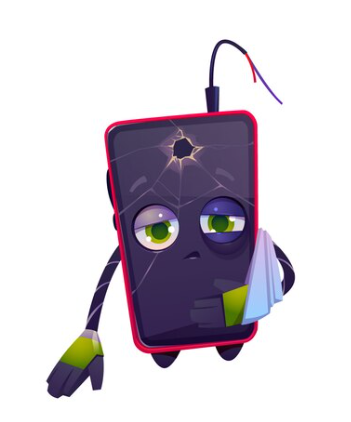
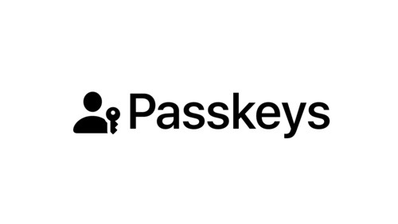

# Password

:::::::::::::: {.columns}
::: {.column width="30%"}

- Forgotten
- Leaked
- Fatigue

:::
::: {.column width="70%"}

:::
::::::::::::::

# Password exposure

:::::::::::::: {.columns}
::: {.column width="30%"}

- Entering password
- Sending password
- Storing password

:::
::: {.column width="70%"}

:::
::::::::::::::

# Asymmetric signing

```{.mermaid width=100% format=svg theme=dark background=transparent}
flowchart LR
  M(message)
  PrK((private key))
  S(signature)
  M --> PrK --> S
```

```{.mermaid width=100% format=svg theme=dark background=transparent}
flowchart LR
  M(message)
  S(signature)
  PubK((public key))
  I{verified}
  M --> PubK
  S --> PubK
  PubK --> I
```

# Asymmetric signing exposure

```{.mermaid width=100% format=svg theme=dark background=transparent}
flowchart LR

subgraph Website
  direction TB
  a(Password Form)
  c(KeyStore)
end

subgraph Server
  b(Public Key)
end

a --Unlock Keystore--> c
c --Signs message--> a
Server --Sign this message--> Website
Website --Sends signature--> Server
```

# WebAuthn

```{.mermaid width=100% format=svg theme=dark background=transparent}
flowchart LR

subgraph Client
  direction TB
  subgraph SE/TEE
    c(KeyStore)
  end

  subgraph Website
  end
end

subgraph Server
  b(Public Key)
end

c --Signs message--> c
Website --Sign this message--> SE/TEE
SE/TEE --Sends signature--> Website
Server --Sign this message--> Website
Website --Sends signature--> Server
```

# WebAuthn

:::::::::::::: {.columns}
::: {.column width="50%"}

- Secure Enclave/Trusted Execution Environment
- No more forgotten passwords
- No more passwords leaked
- Easy to access

Lost or broken device?

:::
::: {.column width="50%"}

:::
::::::::::::::

# Passkeys

:::::::::::::: {.columns}
::: {.column width="50%"}

- Extention on top of WebAuthn
- Defaults to Google/iCloud
- Allows 3rd party storage

:::
::: {.column width="50%"}

:::
::::::::::::::

# Register Demo

:::::::::::::: {.columns}
::: {.column width="50%"}

Register now and get a 10 KDA welcome bonus!

:::
::: {.column width="50%"}

:::
::::::::::::::

#

{style="object-fit: contain; position: fixed; top: 0; left: 0; width: 100vw; height: 100vh; z-index: 0;" autoplay="autoplay"}

# Webshop Demo

:::::::::::::: {.columns}
::: {.column width="50%"}

Order your cookie now with WebAuthn!

:::
::: {.column width="50%"}

:::
::::::::::::::

# Thank you

Andy Tang
@andortang
