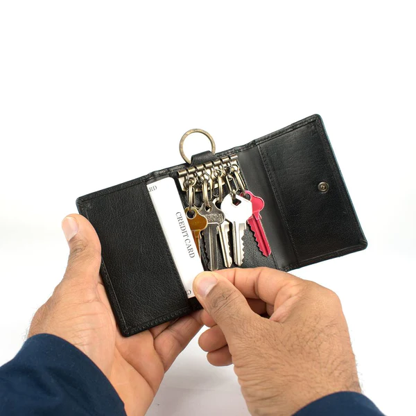

# Password

:::::::::::::: {.columns}
::: {.column width="30%"}

- Forgotten
- Leaked
- Fatigue

:::
::: {.column width="70%"}

:::
::::::::::::::

# Password exposure

```{.mermaid width=100% format=svg theme=dark background=transparent}
journey
  title Login flow
  section User laptop
    Navigate to website: 5: security
    Enter username + password: 3: security
    Submit form: 1: security
  section Server
    Lookup user details: 2: security
    Verify credentials: 2: security
```

# Asymetric signing

```{.mermaid width=100% format=svg theme=dark background=transparent}
flowchart LR
  M(message)
  PrK((private key))
  S(signature)
  M --> PrK --> S
```

```{.mermaid width=100% format=svg theme=dark background=transparent}
flowchart LR
  M(message)
  S(signature)
  PubK((public key))
  I{verified}
  M --> PubK
  S --> PubK
  PubK --> I
```

# Asymetric signing exposure

```{.mermaid width=100% format=svg theme=dark background=transparent}
journey
  title Sign flow
  section User laptop
    Navigate to website: 5: security
    Enter password to unlock store: 3: security
    Sign message: 4: security
    Send signature: 4: security
  section Server
    Lookup user details: 4: security
    Verify credentials: 4: security
```

# Registration

:::::::::::::: {.columns}
::: {.column width="30%"}

- Privacy
- Tedious
- Trust

:::
::: {.column width="70%"}

:::
::::::::::::::

# Password exposure

```{.mermaid width=100% format=svg theme=dark background=transparent}
journey
  title Registration flow
  section User laptop
    Navigate to website: 5: security
    Enter username + password: 3: security
    Submit form: 1: security
```

# Password exposure

```{.mermaid width=100% format=svg theme=dark background=transparent}
journey
  title Registration flow
  section Server
    Hash user password: 2: security
    Store user details: 2: security
    Send confirmation email: 2: security
  section User laption
    Click on confirmation link: 1: security
```

# Wallet registration

:::::::::::::: {.columns}
::: {.column width="30%"}

More secure, but still...

- Tedious
- Trust

:::
::: {.column width="70%"}

:::
::::::::::::::

# Wallet registration

```{.mermaid width=100% format=svg theme=dark background=transparent}
journey
  title Registration flow
  section User laptop
    Navigate to wallet: 5: security
    Generate mnemonics: 5: security
  section Multiple pieces of paper
    Store mnemonics: 4: security
```

# Wallet registration

```{.mermaid width=100% format=svg theme=dark background=transparent}
journey
  title Registration flow
  section User laptop
    Enter (partial) mnemonics: 4: security
    Enter password: 3: security
    Generate keypairs: 4: security
    Submit public key: 5: security
  section Server
    Store public key: 5: security
```

# WebAuthn

```{.mermaid width=100% format=svg theme=dark background=transparent}
journey
  title Registration flow
  section User laptop
    Navigate to wallet website: 5: security
    Pair device with wallet: 5: security
  section Phone
    Request permission: 5: security
    Approve with biometrics: 5: security
  section SE/TEE
    Generate keypair: 5: security
```

# WebAuthn

```{.mermaid width=100% format=svg theme=dark background=transparent}
journey
  title Registration flow
  section User laptop
    Register device info: 5: security
  section Phone
    Approve with biometrics: 5: security
  section SE/TEE
    Sign device info: 5: security
  section User laptop
    Submit device info: 5: security
  section Blockchain
    Store device info: 5: security
```

# WebAuthn

:::::::::::::: {.columns}
::: {.column width="50%"}

- Secure Enclave/Trusted Execution Environment
- No more forgotten passwords
- No more passwords leaked
- Easy to access

Lost or broken device?

:::
::: {.column width="50%"}

:::
::::::::::::::

# Passkeys

:::::::::::::: {.columns}
::: {.column width="50%"}

- Extention on top of WebAuthn
- Defaults to Google/iCloud
- Allows 3rd party storage

:::
::: {.column width="50%"}

:::
::::::::::::::

# Register Demo

:::::::::::::: {.columns}
::: {.column width="50%"}

Register now and get a 10 KDA welcome bonus!

:::
::: {.column width="50%"}

:::
::::::::::::::

#

{style="object-fit: contain; position: fixed; top: 0; left: 0; width: 100vw; height: 100vh; z-index: 0;" autoplay="autoplay"}

# Webshop Demo

:::::::::::::: {.columns}
::: {.column width="50%"}

Order your cookie now with WebAuthn!

:::
::: {.column width="50%"}

:::
::::::::::::::
